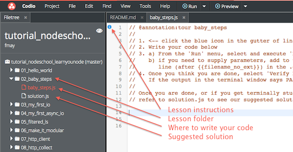

#Tutorial 01 - Learn You Node
**Learn the basics of node: asynchronous i/o, http**

*All content is written and produced by [http://nodeschool.io](http://nodeschool.io). Please see the credits at the bottom of this page and if you have learnt a lot from these tutorials, please make a donation (also at the bottom).*

##One time setup
First of all, we'll install the tutorial

1. Open up the Console with TODO
1. Enter `npm install -g learnyounode`. This will download and install the tutorial into your project container.

##Start coding!
There are three ways you can use the tutorials. 

###Tutorial Mode (recommended)
Codio has a neat Tutorial Mode that guides you between different lessons. It remembers where you get to between sessions and you can move between lessons using navigation buttons.

From the menu, select `Tools>Tutorial Mode`.

###Manual Mode
If you prefer, you can explore the folder structure, where each lesson is a folder. Inside each lesson, you will find a `homework.js` file. You will see a blue icon on line 1 of the file. Click on it and your instructions will appear. You can start coding right away. The popup window can be resized and moved and can be left there while you code away.

###From the Console
There is not a lot of reasons why you would want to do it this way but for completeness, it's worth knowing about. Each tutorial is installed as node module that can be run from the command line. If you take a look at the [http://nodeschool.io](http://nodeschool.io) documentation, you can see how everything can be done from the command line.

##Running your code
When you're ready to test your code, you use the right-most option in the menu bar (see the image below). If you click on the arrow, you will see various commands that are available to you. Each of these commands runs a console command. You can add your own if you like by editing the `.shortcuts` file.

- The dropdown menu should default to 'Run'. This will run your code using the tutorial framework. It supplies input data automatically if required. You will then see output in your Console window.
- If you click on the dropdown arrow, you will also see a 'Run using Node' option. This will run your code using node itself. If you want to customize the inputs, then edit the `.shortcuts` file where you can customize all input parameters and even add new ones.
- You can run your code from the command line in the console. You will need to navigate to the folder containing the correct `homework.js` file and then enter `learnyounode run homework.js` or `node homework.js`.

##Verifying your code
Once you think you have completed the challenge, select the 'Verify' option from the same dropdown menu and then press the button. The output will be shown in the console window. If it verifies correctly, you will see your lesson folder highlighted, so you know which lessons you have completed successfully.

You could also verify from the command line (although it is more long-winded) by navigating to the folder containing the correct `homework.js` file and then entering `learnyounode verify homework.js`. 

##Which lessons have I successfully completed?
If you press the "Where am I?" command from the same menu, you will be shown in the console the list of all challenges that are already completed.

##Cheating (checking the recommended solution)
Each lesson comes with a `solution.js` file. Try to avoid looking at it other than for verification purposes. We have highly sophisticated algorithms built into Codio that will detect any forms of cheating, peeking (however quick and subtle) and will publicly expose to your peers.

##Other Tutorials
[http://nodeschool.io](http://nodeschool.io) has a several excellent tutorials. We have packaged these up so they run within Codio and the full set can be found on our [Nodeschool Tutorial page.](http://codio.com/tutorials)

##Credits

The Nodeschool tutorials are the much excellent work of the following hackers

Rod Vagg ([github/rvagg](https://github.com/rvagg), [twitter@rvagg](http://twitter.com/rvagg)), 
Andrey Sidorov ([github/sidorares](https://github.com/sidorares), [twitter@sidorares](http://twitter.com/sidorares)), 
Julián Duque ([github/julianduque](https://github.com/julianduque), [twitter@julian_duque](http://twitter.com/julian_duque)), 
Lars-Magnus Skog ([github/ralphtheninja](https://github.com/ralphtheninja), [twitter@ralphtheninja](http://twitter.com/ralphtheninja)), 
Tim Inman ([github/thehack](https://github.com/thehack), [twitter@timinman](http://twitter.com/timinman)), 
Dan Flettre ([github/Flet](https://github.com/Flet), [twitter@flettre](http://twitter.com/flettre)) 

##Donations
If you feel you have benefitted from this or the other tutorials, how about [donating to Rodd Vagg using gittip](https://www.gittip.com/rvagg/)?
