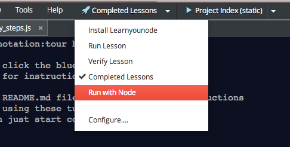
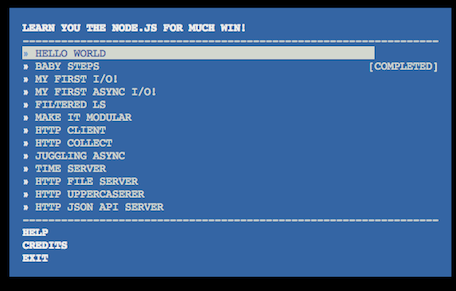

#Tutorial 01 - Learn You Node
**Learn the basics of node: asynchronous i/o, http**

*All content is written and produced by [http://nodeschool.io](http://nodeschool.io). Please see the credits at the bottom of this page and if you have learnt a lot from these tutorials, please make a donation (also at the bottom).*

#One time setup for this module
First of all, we'll install the tutorial

1. Open up the Console from 'Tools->Terminal'
1. Enter `npm install -g learnyounode`. This will download and install the tutorial into your project container.

#3 Ways to write your code
There are three different ways you can use Codio to run the Nodeschool.io tutorials. You can switch between them if you want.

- **Tutorial Mode** : select the 'Tools->Tutorial' menu item. Each lesson is presented with a Code window on the left and the instructions on the right, which can be scrolled through and left in place while you code. You can navigate between lessons using the buttons above the instructions.
- **Manual Mode** : open up the lessons folders and you will see a filename similar to the folder name. You can write your code here and click on the blue icon in the gutter to open up the instructions popup.
- **Command Line** : you can follow the instructions directly from [http://nodeschool.io](http://nodeschool.io) and use Codio as your editor. You can open up a Terminal from the 'Tools->Terminal' menu item. The code you edit from Codio will appear in the `~/workspace` folder.

#Testing your code
There are 2 ways you can test out your code using Node.js.

###Shell out to the Terminal
You can open a Terminal window at any time by selecting the 'Tools->Terminal' menu item. Your terminal defaults to the `~/workspace` folder, which equates to the root of your Codio code project. If you are writing your code in the lesson folder (for example `02_baby_steps`) then you will need to `cd` into that folder, so something like this

    cd 02_baby_steps
    node baby_steps.js 1 2 3

###Add an entry to the 'Run' menu
To save yourself using the terminal, you can set up an entry in the 'Run' menu in Codio. To do this, open up the `.codiorun` file in the root of your project and add the following entry

    "Lesson Test" : "node {{filepath}} 1 2 3"
    
Codio will replace the token with the correct path to the file. You must ensure that you are looking at the file you want to test before you run it. You will also need to modify the arguments in the `codiorun` file to suit each lesson.

You'll then see "Lesson Test" in your Run menu, like this

#Running your Code via the Tutorial system
When you've got your code to the point where you think it is ready for the Tutorial system to check it, you should select the 'Run Lesson' item from the 'Run' menu. The tutorial system will automatically supply any required arguments to your project as required by the current lesson. You can see the 'Run Lesson' item in the above menu screenshot.

#Verifying your code
Once you think you have completed the challenge, select the 'Verify Lesson' option from the 'Run' dropdown menu. The output will be shown in the console window. If is passes, you will see something like this

#Which lessons have I successfully completed?
If you press the "Completed Lessons" command from the same menu, you will be shown in the console the list of all challenges that are already completed. You will see the following screen in the Terminal window hat appears. Completed lessons are clearly marked on the right.

#Cheating (checking the recommended solution)
Each lesson comes with a `solution.js` file. Try to avoid looking at it other than for verification purposes. We have highly sophisticated algorithms built into Codio that will detect any forms of cheating, peeking (however quick and subtle) and will publicly expose to your peers.

#Doing everything from the command line
For completeness sake, you can do everything from the command line rather than using Codio. Just open up the Terminal window from 'Tools->Terminal'.

Each tutorial is installed as node module that can be run from the command line. If you take a look at the [http://nodeschool.io](http://nodeschool.io) documentation, you can see how everything can be done from the command line.

#Other Tutorials
[http://nodeschool.io](http://nodeschool.io) has a several excellent tutorials. We have packaged these up so they run within Codio and the full set can be found on our [Nodeschool Tutorial page.](http://codio.com/tutorials)

#Credits

The Nodeschool tutorials are the much excellent work of the following hackers

Rod Vagg ([github/rvagg](https://github.com/rvagg), [twitter@rvagg](http://twitter.com/rvagg)), 
Andrey Sidorov ([github/sidorares](https://github.com/sidorares), [twitter@sidorares](http://twitter.com/sidorares)), 
Julián Duque ([github/julianduque](https://github.com/julianduque), [twitter@julian_duque](http://twitter.com/julian_duque)), 
Lars-Magnus Skog ([github/ralphtheninja](https://github.com/ralphtheninja), [twitter@ralphtheninja](http://twitter.com/ralphtheninja)), 
Tim Inman ([github/thehack](https://github.com/thehack), [twitter@timinman](http://twitter.com/timinman)), 
Dan Flettre ([github/Flet](https://github.com/Flet), [twitter@flettre](http://twitter.com/flettre)) 

##Donations
If you feel you have benefitted from this or the other tutorials, how about [donating to Rodd Vagg using gittip](https://www.gittip.com/rvagg/)?
